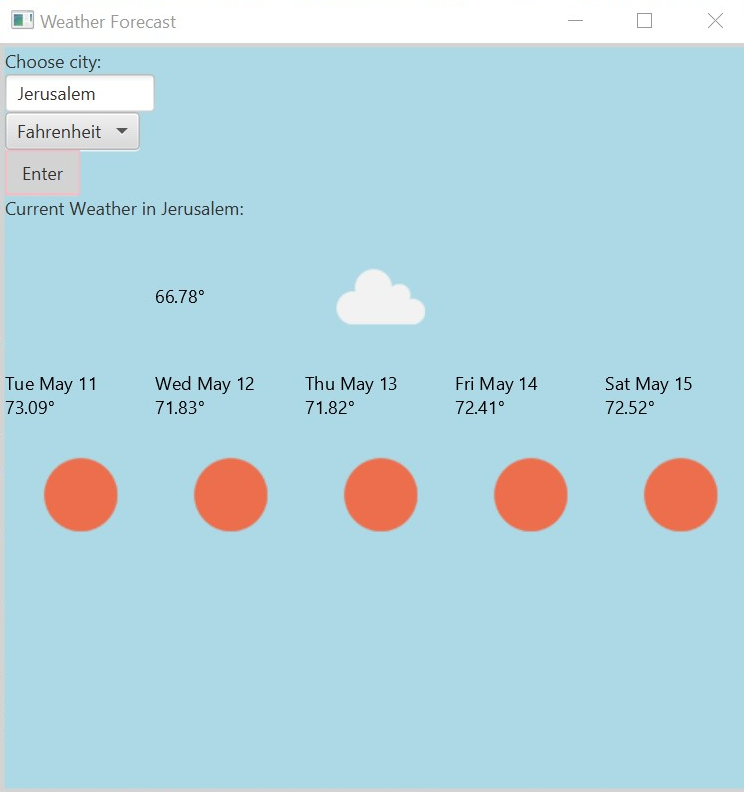

# Mini Weather Application
## Overview

This is a mini weather forecasting app.
The user can choose any city and choose to get the temperature in degrees Fahrenheit or Celsius.
The app will return the current weather, as well as a five-day weather forecast for the provided location.

##Links

This app uses the OpenWeatherMap API: [OpenWeatherMap](https://openweathermap.org)

